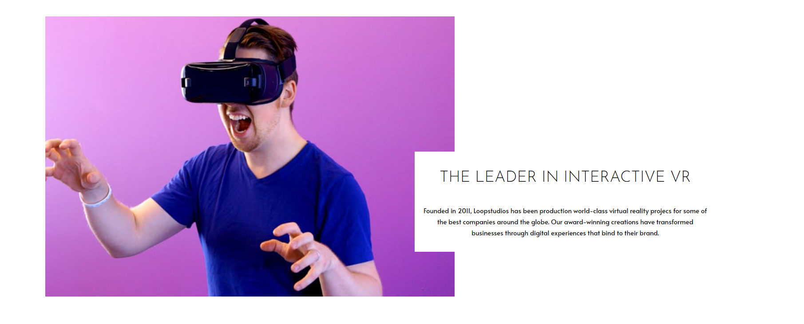

# Frontend Mentor - Loopstudios Landing Page solution

This is a solution to the [Loopstudios Landing Page on Frontend Mentor](https://www.frontendmentor.io/challenges/social-links-profile-UG32l9m6dQ). Frontend Mentor challenges help you improve your coding skills by building realistic projects.

## Table of contents

- [Overview](#overview)
  - [The challenge](#the-challenge)
  - [Screenshot](#screenshot)
  - [Links](#links)
- [My process](#my-process)
  - [Built with](#built-with)
- [Author](#author)

## Overview

### The challenge

Users should be able to:

Build a responsive landing page that adapts the navigation menu depending on whether the project is accessed on mobile devices or desktops.

### Screenshot

### Links

- [Live site](https://your-live-site-url.com)

## My process

### Built with

- React JS
- Semantic HTML5 markup
- CSS custom properties
- Flexbox

## Author

- Frontend Mentor - [@allesonsales](https://www.frontendmentor.io/profile/allesonsales)
